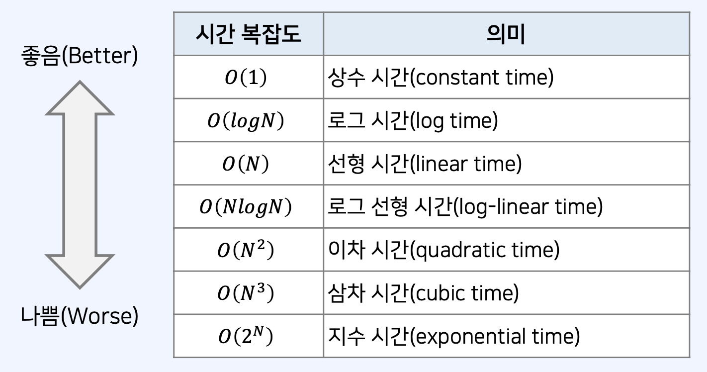

<h3>시간 복잡도</h3>

• 시간 복잡도는 알고리즘의 성능을 나타내는 척도이다. <br />
• 시간 복잡도: 특정한 크기의 입력에 대하여 알고리즘의 수행 시간 분석 <br />
• 동일한 기능을 수행하는 알고리즘이 있다면, 일반적으로 복잡도가 낮을수록 우수하다. <br />

<b>빅오 표기법(Big-O Notation)</b>

• 가장 빠르게 증가하는 항만을 고려하는 표기법이다. <br />
• 함수의 상한(가장 빠르게 증가하는 것)만을 나타내게 된다. <br />
• 예를 들어 연산 횟수가 3𝑁3 + 5𝑁2 + 1,000,000인 알고리즘이 있다고 하자. <br />
• 𝑁이 증가함에 따라서, 3𝑁3을 제외한 다른 항의 영향력은 작아진다. <br />
• Big-O 표기법에서는 차수가 가장 큰 항에서 계수를 제외하여 𝑂 𝑁3 으로 표현된다. <br />

 <br />

<b>예시1</b>

𝑁개의 데이터의 합을 계산하는 프로그램 예제 <br />

```javascript
let array = [3, 5, 1, 2, 4]
// 5개의 데이터(N = 5)
let summary = 0 // 합계를 저장할 변수
// 모든 데이터를 하나씩 확인하며 합계를 계산
for (let i = 0; i < array.length; i++) {
  summary += array[i]
}
// 결과를 출력
console.log(summary)
```

• 수행시간은데이터의개수𝑁에비례할것임을예측할수있다. <br />
• 시간복잡도:𝑂𝑁 <br />

<b>예시2</b>

2중 반복 문법을 이용하는 프로그램 예제 <br />

```javascript
let array = [3, 5, 1, 2, 4] // 5개의 데이터(N = 5)
for (let i = 0; i < array.length; i++) {
  for (let j = 0; j < array.length; j++) {
    let temp = array[i] * array[j]
    console.log(temp)
  }
}
```

• 시간복잡도:𝑂𝑁2<br />
• [참고]모든2중반복문법의시간복잡도가𝑂 𝑁2 인것은아니다.<br />
• 소스코드가 내부적으로 다른 함수를 호출한다면 그 함수도 고려해야 한다.<br />

<b>알고리즘 설계 Tip</b><br />

• 일반적인 CPU 기반의 개인 컴퓨터나 채점 목적의 컴퓨터를 고려해 보자. <br />
• JavaScript를 기준으로 1억 번의 연산을 처리하기 위해 1~5초가량의 시간이 소요된다. <br />
• 𝑂 𝑁3 의 알고리즘을 설계한 경우, 𝑁의 값이 5,000이 넘는다면 얼마나 걸릴까? <br />
• 코딩 테스트 문제에서 시간 제한은 통상 1~5초가량이다. <br />
• 문제에 명시되어 있지 않은 경우 대략 5초 정도라고 생각하고 문제를 푸는 것이 합리적이다. <br />

<b>요구사항에 따라 적절한 알고리즘 설계하기</b><br />

• 문제에서 가장 먼저 확인해야 하는 내용은 시간제한(수행 시간 요구사항)이다.<br />
• 시간 제한이 1초인 문제를 만났을 때, 일반적인 기준은 다음과 같다.<br />
• 𝑁의범위가500인경우:시간복잡도가𝑂 𝑁3 인알고리즘을설계하면문제를풀수있다.<br />
• 𝑁의범위가2,000인경우:시간복잡도가𝑂 𝑁2 인알고리즘을설계하면문제를풀수있다.<br />
• 𝑁의 범위가 100,000인 경우: 시간 복잡도가 𝑂 𝑁𝑙𝑜𝑔𝑁 인 알고리즘을 설계하면 문제를 풀 수 있다.<br />
• 𝑁의 범위가 10,000,000인 경우: 시간 복잡도가 𝑂 𝑁 인 알고리즘을 설계하면 문제를 풀 수 있다.<br />
