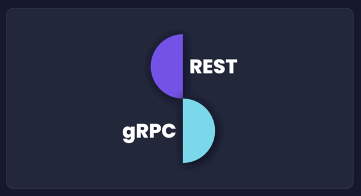

<br /><br />

https://amplication.com/blog/rest-vs-grpc-whats-the-difference<br />

`REST와 gRPC의 차이점`에 대하여 흥미롭게 정리한 글이 있어서 공유 드리겠습니다 :)<br /><br />

<br /><br />요약:

```
REST는 오랫동안 사용되어 온 기술로, API 개발 및 설계에 대한 업계 표준입니다.
gRPC는 구글이 개발한 빠르고 확장 가능한 API를 구축하기 위한 개발된 프레임워크 입니다.

REST란?
REST는 Representational State Transfer의 약자로,
API 및 웹 기반 및 마이크로서비스 기반 애플리케이션을 설계하는 데 사용되는 가장 일반적인 아키텍처 스타일입니다.
REST는 표준 HTTP 프로토콜을 기반으로하며 각 RESTful 웹 서비스는 리소스를 나타냅니다.
이러한 리소스는 HTTP 표준 메소드(GET, POST, PUT, DELETE)를 사용하는 공통 인터페이스를 통해 가져오거나 조작할 수 있습니다.

gRPC란?
Google Remote Procedure Call (gRPC)은 RPC 프로토콜을 기반으로 만들어졌습니다.
RPC 프로토콜은 HTTP 2.0을 기반으로 한 오픈 소스, 크로스 플랫폼, 고속 통신 프로토콜로 분산 애플리케이션의 서비스 간 통신에 널리 사용됩니다.

REST와 gRPC 비교

-작동 모델
REST는 HTTP 1.1 프로토콜을 기반으로하며 요청-응답 모델을 기반으로 API를 정의합니다.
반면 gRPC는 HTTP 2.0 프로토콜을 기반으로하며 양방향 통신 기능과 기존 응답-요청 모델을 사용합니다.
즉, REST API에서는 여러 클라이언트의 다중 요청이 순차적으로 처리되지만 gRPC에서는 여러 요청이 동시에 처리됩니다.

-통신 모델
REST와 gRPC는 서버와 클라이언트 간 요청을 보내고 응답을 받기 위해 다른 메시지 형식을 사용합니다.
REST API는 일반적으로 JSON을 사용하여 서버와 클라이언트 간 메시지를 주고받습니다.
반면 gRPC는 프로토콜 버퍼를 사용하여 직렬화 및 통신을 수행합니다.
프로토콜 버퍼(Protobuf)는 데이터 직렬화를 위한 효율적이고 강력한 패키지 형식으로, 빠른 응답 전달이 가능합니다.
또한 Protobuf는 네트워크를 통해 메시지를 전송할 때 더 빠르게 작동합니다.

-브라우저 지원 및 지연 시간
HTTP 1.1 프로토콜은 범용 브라우저 지원을 제공하여 REST가 모든 브라우저에서 사용할 수 있습니다.
그러나 HTTP 2.0 프로토콜은 제한된 브라우저 지원을 제공하므로, 일부 브라우저(주로 이전 버전)와 호환되지 않는 gRPC가 됩니다.

-데이터 형식 및 직렬화
REST는 JSON, XML 등 여러 데이터 형식을 사용합니다.
JSON은 이해하기 쉽고 유연하기 때문에 가장 일반적으로 사용되지만, REST는 엄격한 데이터 구조를 요구하지 않습니다.
이러한 유연성으로 인해 비판적이지 않은 데이터 전송에 적합합니다.
한편, gRPC는 전송이 더욱 신뢰성있게 이루어질 수 있도록 Protobuf 메시지 형식만을 지원합니다.

-gRPC를 REST보다 선호하는 경우:

낮은 지연 시간과 빠른 데이터 전송이 필요한 경우: gRPC는 HTTP/2를 사용하여 다중 요청을 동시에 처리할 수 있고,
프로토콜 버퍼를 통해 데이터를 빠르게 전송할 수 있습니다.

마이크로서비스 아키텍처를 구축하는 경우: gRPC는 경량 메시징과 저전력 네트워크를 위한 고효율 연결을 제공합니다. 이는 실시간 메시지 전송과 같은 작업에 적합합니다.

다양한 언어로 개발된 서비스 간 통신이 필요한 경우: gRPC는 기본 코드 생성을 제공하여 다중 언어 환경에서 애플리케이션 개발을 지원합니다.

REST와 gRPC 중 어느 것이 더 나은지 확실하게 말하기는 어렵습니다.
gpc는 대규모 분산 애플리케이션에는 gRPC가 더 유용하다고 결론 내릴 수 있습니다.
하지만 인기가 아직은 없으며, 브라우저 호환성이 제한적입니다.
```

역시나 정답은...각자의 환경에 맞게 신중한 선택을!
