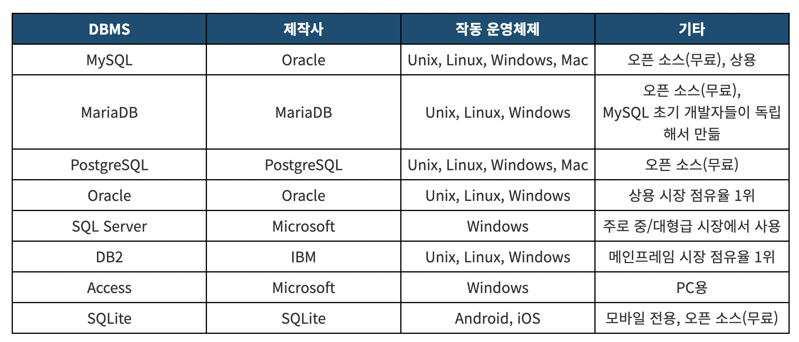
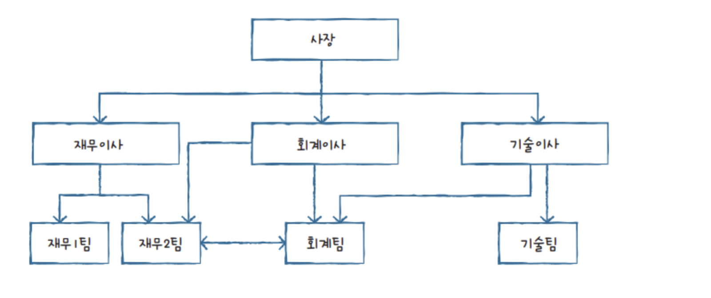
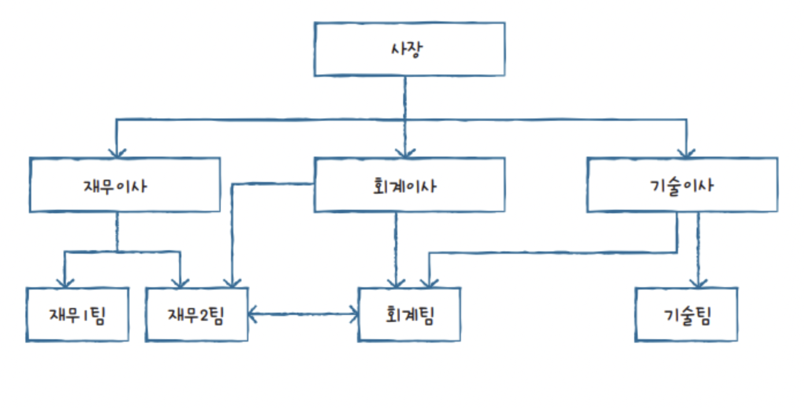
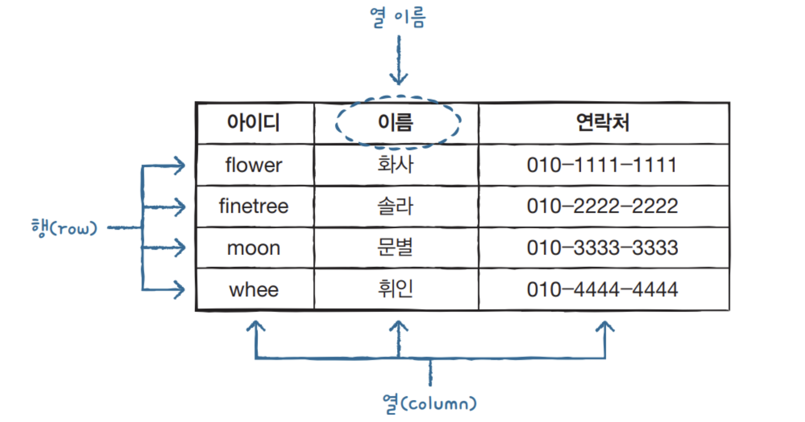

<b>데이터베이스</b>

데이터베이스는 간단히 말해 데이터의 집합입니다.  
우리 일상생활에서 경험하는 다양한 정보들, 예를 들어 카카오톡 메시지, 인스타그램 사진, 대중교통 카드 정보, 카페에서 구매한 음료 등도  
모두 데이터베이스에 기록되고 관리됩니다. 이러한 데이터베이스는 우리 삶에 깊이 뿌리를 내리며, 다양한 분야에서 활용되고 있습니다.  

<b>DBMS(Database Management System)</b>

데이터베이스를 효율적으로 관리하고 운영하기 위해서는 DBMS(Database Management System)라는 소프트웨어가 필요합니다. 
DBMS는 다양한 데이터가 저장되어 있는 데이터베이스를 여러 명의 사용자나 응용 프로그램과 공유하며 동시에 접근이 가능하게 해줍니다. 

예를 들어 은행의 예금 계좌 정보를 모아놓은 데이터베이스는 많은 사람들이 가지고 있습니다. 
이러한 데이터베이스는 예금 계좌 주인, 은행 직원, 인터넷 뱅킹, ATM 기기 등에서 모두 동시에 접근이 가능합니다. 
이는 DBMS가 이러한 다중 접근을 가능하게 해주기 때문입니다. 

 

<b>계층형 DBMS</b>

 

계층형 DBMS는 1960년대에 등장한 초기 데이터베이스 관리 시스템입니다. 
이 구조는 트리 형태로 구성되어 있으며, 각 레벨이 서로 연결되어 있습니다. 
예를 들어, 사장 아래에 이사들이 연결되는 방식입니다. 
그러나 계층형 DBMS는 구성 변경이 어렵고, 효율성이 떨어진다는 문제가 있습니다. 현재 이러한 구조는 거의 사용되지 않습니다. 

<b>망형 DBMS</b>

 

네트워크 DBMS는 1970년대에 출현하여 계층형 DBMS의 한계를 극복하기 위한 방식으로 개발되었습니다. 
이 구조는 하위 구성원 간의 연결이 유연해진 것을 확인할 수 있습니다. 
그러나 네트워크 DBMS의 활용을 위해서는 프로그래머가 전체 구조를 파악해야 프로그램 작성이 가능하다는 단점이 있습니다. 
현재 이 방식은 거의 사용되지 않고 있습니다. 

<b>관계형 DBMS</b>

 

RDBMS에서는 모든 데이터가 테이블 형태로 저장되며, 이러한 구조가 RDBMS의 핵심입니다. 
테이블은 열과 행으로 구성되어 있어, 이 구조를 이해하는 것이 RDBMS를 파악하는 데 중요합니다. 

스키마(Schema): 데이터베이스의 구조를 정의하는 데 사용되는 설계도입니다. 스키마는 테이블, 열, 행, 인덱스, 제약 조건 등 데이터베이스의 모든 구성 요소를 포함합니다. 

키(Key): 테이블 내에서 데이터를 식별하고 관계를 맺기 위한 특정 열을 의미합니다. 
주요 키 유형으로는 기본 키(Primary Key), 외래 키(Foreign Key), 고유키(Unique Key) 등이 있습니다. 

인덱스(Index): 데이터 검색 속도를 높이기 위해 사용되는 데이터베이스 객체입니다. 인덱스는 특정 열의 값을 참조하고 정렬하여 검색 성능을 향상시킵니다. 

SQL(Structured Query Language): RDBMS에서 데이터를 검색, 삽입, 수정 및 삭제하기 위해 사용되는 표준 질의 언어입니다. 
SQL은 데이터 조작, 정의, 제어 등의 작업을 수행할 수 있습니다. 

트랜잭션(Transaction): RDBMS에서 데이터 작업을 묶은 일련의 과정입니다. 
트랜잭션은 원자성(Atomicity), 일관성(Consistency), 격리성(Isolation), 지속성(Durability)을 보장하는 ACID 속성을 지원합니다. 

사진 출처 및 내용 참고: 혼공 한빛 데이터 베이스 이해하기 
