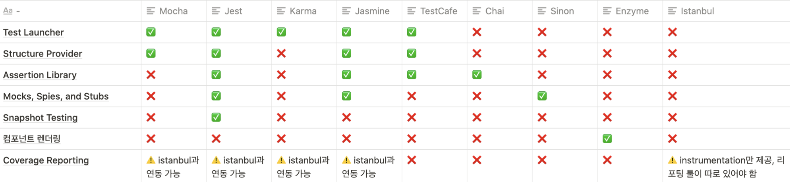

## \* 테스팅 시스템에 대하여 알아보고 정교한 코드 만들기

최근 신사업 프로젝트를 런칭하고 사후작업으로 Storybook 과 test-convention을 적용 시키는 사이드 업무를 직접 맡기로 했다. <br />
다같이 쓰는 컨벤션을 만든다는 점에서 매우 흥미로웠다.<br />

먼저, 테스트코드는 개발 워크플로우에서 테스트를 자동화해 원치않는 Side Effect를 줄이고 애플리케이션의 품질을<br />
향상 시키며 치명적인 오류를 사전에 방지함을 목적으로 한다고 볼 수 있다.<br />

해당 파트에서는 <b>테스트 라이브러리, 용어, 코드 스니펫</b>를 정리하여 예제 코드를 작성해 본다.<br /><br />

---

<br />

### - Type 테스트의 유형

1. <b>Unit Tests(단위 테스트):</b> 최소 단위의 util 함수, 커스텀 리액트 hook, 단일 컴포넌트등을 테스트 한다.<br />

2. <b>Integration Tests(통합 테스트):</b> 어떤 어플리케이션에서 여러개의 요소들이 같이 돌렸을 때 어떻게 동작하는지 확인하는 테스트를 한다.<br />

3. <b>End-to-end Tests (E2E):</b> 어떤 사용자가 웹앱을 사용하는 것처럼 시뮬레이션을 돌린다.(서버,인프라,웹앱에 대한 통합 테스트)<br /><br /><br />

### - Terms 테스트 관련 용어

1. <b>Spy :</b> 어떤 함수의 실행 여부를 기록하고, 함수가 실행될 떄마다 그의 응답 <b>값</b>,<b>argument</b>등을 기록해 준다.<br />

2. <b>Stubbing :</b> 테스트 호출 중 stub은 테스트 중 만들어진 호출에 대해 <b>미리 준비된</b>답변을 제공 하는 것.<br />
   /만들어진 mock객체의 메소드를 실행했을 때 어떤 리턴 값을 리턴할지 정의 하는 것./<br />

3. <b>Mock :</b> 실제 객체를 만들어 사용하기에 시간, 비용 등의 Cost가 높거나 혹은 객체 서로간의 의존성이 강해 구현하기 힘들 경우 가짜 객체를 만들어 사용하는 방법이다.<br />

4. <b>Assertion :</b> 내가 원하는 결과를 받고 있을까? 확인해주는 기능<br />
   /assertion 라이브러리들은 변수(객체,배열,문자,숫자)가 쉽고 가독성 좋게 비교할 수 있는 utility 함수들을 제공한다./<br />

5. <b>Snapshot 테스트 :</b> 어떤 기능의 예상 결과를 미리 정확히 포착해두고 실제 결과에 비교하는 테스트 기법 <br /><br /><br />

### - Element 유닛/통합 테스트를 위한 요소들

1. Test Launchers: CLI 또는 Node.js를 통해 테스트를 수행하고, jsDOM 또는 브라우저에 테스트를 실행할 수 있게 하는 툴<br />
   `<jset> <mocha> <karma> <testCafe> <jasmine> 등`<br /><br />

2. Structure Providers: 테스트 작성을 할 떄 가독성 좋게 테스트 케이스 조합, 순서를 맞출 수 있도록 제공하는 global 함수(describe, test, it) 제공 <br />
   `<jset> <mocha> <testCafe> <jasmine> 등` <br /><br />

3. Assertion Libraries: 어떤 테스트가 원하는 결과를 받고 있는지 util 함수를 제공해 주는 라이브러리 (expect) <br />
   `<jset> <jasmine> 등` <br /><br />

4. 컴포넌트 렌더링 라이브러리: 리액트에서 컴포넌트를 렌더하고, 렌더링된 컴포넌트에서 원하는 element를 찾을 수 있도록 selector를 제공해주며, <br />
   element에서 다양한 이벤트(onChange, onClick 등)을 호출할 수 있게 한다. <br />
   `<enzyme> <@testing-library> 등` <br /><br /><br />

<br />

---

### JEST + ENZYME SAMPLE 테스트코드 작성하기

```JSX
// component
import React from "react";
import { useSelector } from "react-redux";

const SubmitComponent = (props) => {
  const { onChange, onSubmit } = props;
  const submitTitle = useSelector((state) => state.submitTitle);

  function handleSubmit() {
    console.log("Submit 작동 확인!");
    onSubmit();
  }

  return (
    <div className="wrap">
      <h1>{submitTitle}</h1>
      <input type="text" onChange={onChange} />
      <button type="button" onClick={handleSubmit}>제출</button>
    </div>
  );
};

export default SubmitComponent;
```

테스트 컴포넌트는 input을 수정하면 props에 받은 onChange 이벤트 핸들러를 실행시키며, <br />
제출 button 클릭 시 콘솔에 로그를 출력하고 props에서 받은 onSubmit 이벤트 핸들러를 실행 시킨다. <br />
그후 출력물은 submitTitle을 컴포넌트에 재노출 시킨다. <br /><br />

```JSX
// snapshot Render 테스트
import React from 'react';
import { configure, shallow } from 'enzyme';
import { useSelector } from 'react-redux';

import SubmitComponent from "./SubmitComponent";

describe("<SubmitComponent />", () => {
  it("should render SubmitComponent", () => {
    const component = shallow(<SubmitComponent {...props} />);
    // enzyme에서 렌더해 주는 컴포넌트의 snapshot 생성하고 비교하기
    expect(component).toMatchSnapshot();
  });
});
```

Enzyme에서 shallow를 통해 렌더링하고, jest에서 제공하는 <br />
toMatchSnapshot()라는 assertion을 통해 snapshot 테스팅을 완성한다.<br />

```JSX
// event 핸들링 테스트
import { shallow } from 'enzyme';

import SubmitComponent from "./SubmitComponent";

it('should handle click events', () => {
  const spy = jest.spyOn(console, 'log');
  // onClick 이벤트를 통해 발생하는 console.log를 spy 한다.
  const component = shallow(<SubmitComponent {...props} />);

  component.find('button').simulate('click');
  // Enzyme에서 제공하는 selector로 find 후 클릭 이벤트 호출

  expect(spy).toBeCalled();
  // click 이벤트로 감시한 console에 대한 기대값이 불렸는지 테스트
});


it('should handle input change', () => {
  const handleChange = jest.fn();
  // jest.fn()통해 간단한 stub을 만들고
  const component = mount(<TestComponent onChange={handleChange} />);

  // onChange 이벤트를 호출
  component.find('input').simulate('change', { target: { value: 'Test value' } });

  expect(handleChange).toBeCalled();
  // props로 넘긴 핸들러 호출되었는지 확인
});
```

```JSX
// 출력에 대한 테스트 진행
import { shallow } from 'enzyme';

import { useSelector } from 'react-redux';
import SubmitComponent from "./SubmitComponent";

jest.mock('react-redux', () => ({
  useSelector: jest.fn(),
}));

// 라이브러리를 mocking해서 useSelector의 로직이 기본 `jest.fn()`로 stubbing
describe("<SubmitComponent />", () => {
  it('renders "REACT"', () => {
    const testResult = 'REACT';

    useSelector.mockReturnValue(testResult);
    // 원하는 테스트에서 응답 값이 mocking
    const component = mount(<SubmitComponent />);

    const title = component.find('h1').text();
    expect(title).toBe(testResult);
  });
});
```

<br />

참조: https://jestjs.io/, 원티드 제품 팀블로그, https://testing-library.com/docs/react-testing-library/intro/
