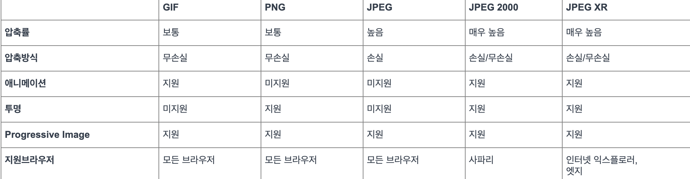

더욱더 웹과 하드웨어의 성능이 매우 좋아지지만 그와 더불어 사용자에게 더욱더 생동감  

있고 현실적인 눈요기를 제시하는 이미지의 화소와 용량이 증가 하고 있습니다.  

프론트엔드 개발자라면 누구나 사용자에게 좋은 경험의 프로덕트를 제시 하고 싶을텐데요 ?  

그중하나가 `이미지 최적화`라고 생각합니다.  

첫번째 스텝으로는 `1. 이미지의 종류 및 특성 파악 하기 입니다.`  

디지털 이미지는 일반적으로 브라우저에서 어떻게 렌더링 되느냐에 따라 `레스터` 이미지 와 `백터` 이미지 타입  그리고 이미지의 손실을 어느 정도 허용하는지에 따라, `무손실` 이미지 타입과 `손실` 이미지 타입으로 구분 됩니다. 

`레스터` 이미지란 픽셀에 표현하고자 하는 색상을 그려서 이미지 형태로 나타내는 방식입니다. 주로 사용하는 
jpeg, png, gif등이 다음과같은 특성을 나타냅니다. 레스터이미지는 여러 픽셀이 모여 하나의 이미지를 만들기  때문에, 사이즈가 크거나 품질이 더 좋은 이미지를 만들기 위해서는 그만큼의 정보를 담은 픽셀들을 추가해야만 
컴퓨터가 정상적으로 표현해 사이즈가 커질수록 이미지의 용량도 증가하고 렌더링 속도도 떨어지게 됩니다. 

`벡터` 이미지란 이미지 안에 수많은 방정식을 포함하는 이미지 형태입니다. 그렇기 떄문에 컴퓨터는 선의 표현, 크기, 색상 등의 정보를  연산하여 이미지를 나타냅니다. 연산과정의 렌더링 때문에 사이즈가 커지거나 작아져도 꺠지거나 정보가 달라지지 않습니다. 그 말은, 항상 이미지 품질을 유지 할 수 있습니다. 
보통 폰트나 아이콘으로 사용되며 대표적으로 svg형태를 많이 사용합니다. 다만 이미지가 복잡할 수록 연산이늘어나 용량또한 증가하게 됩니다. 

`무손실 이미지와 손실 이미지` 의 개념, 이미지의 정보손실을 허용하는지 안하는지의 여부입니다. 
먼저, 원본이미지는 이미지의 정보 그대로를 나태는 이미지입니다. `무손실 이미지`는 그중 렌더링에 필요하지 않은 정보를 제거한 이미지라는  개념이죠, 따라서 원본이미지 보다 용량이 줄어들수 있으며 대표적으로 gif, png를 들 수 있습니다. 

`손실 이미지` 무손실 이미지의 화질을 감수 하더라도 사이즈를 줄여 빠른 렌더링을 할 수있는 형태를 말합니다.  
손실이미지의 사용은 무손실 이미지보다 상대적으로 빠른 렌더링 속도를 보이므로 사용자 꼭 필요한 정보를 빠르게 보게 하는 시각화로서  
사용됩니다. jpeg 확장자가 대표적입니다.  

지금까지 간략하게 이미지 개념에 대해 알아봤는데 웹 개발자라면 이미지 최적화를 위해 어떤 시도를 해야할까요..?  

`첫째는 올바른 이미지 확장자 선택입니다.`  

당연스럽게 압축률이 높고 손실이 적은 이미지 확장자를 선택하는 것이 베스트지만, 용량과 브라우저 환경같은 외부요인이 작용합니다.  
이미지의 렌더링 속도는 용량과 비례합니다. 따라서 화질이 중요한 배너 이미지나 메인 이미지는 좀 더 손실이 적은 이미지로,  
화질과 상관없는 이미지는 손실율이 높지만, 용량이 작은 이미지로 선택하여아 합니다.  

  

추가로 Webp, avif 포맷을 소개해드립니다.  

Webp는 손실압축과 비손실압축을 전부 지원합니다. vp8이라는 비디오 코덱 기술을 기반으로 한 영상압축을 사용해 25~30프로의 압축을 
제공합니다. 또한 투명, 애니메이션 기능도 지원하여 png, gif, jpeg등 상용 이미지 포맷을 대체할 수 있습니다. 
하지만 디바이스 사양에 따라, 상용 이미지 포맷보다 더 높은 리소스를 필요해 하거나, ie를 지원하지 않는점 progressive image 기능을 
지원하지 않는 단점이 있습니다. 

avif 포맷 역시 손실압축과 비 손실 압축을 전부 지원합니다. 상용 이미지 포맷을 대체 가능하며 애니메이션과 투명도 역시 제공합니다.
또한 압축율이 웹피보다 뛰어납니다. 하지만 지원하는 뷰어가 적고 브라우저 지원율이 낮습니다.  
