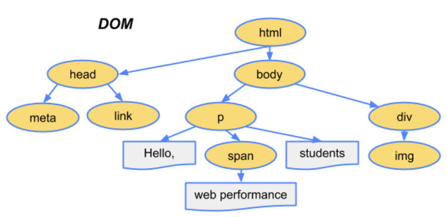
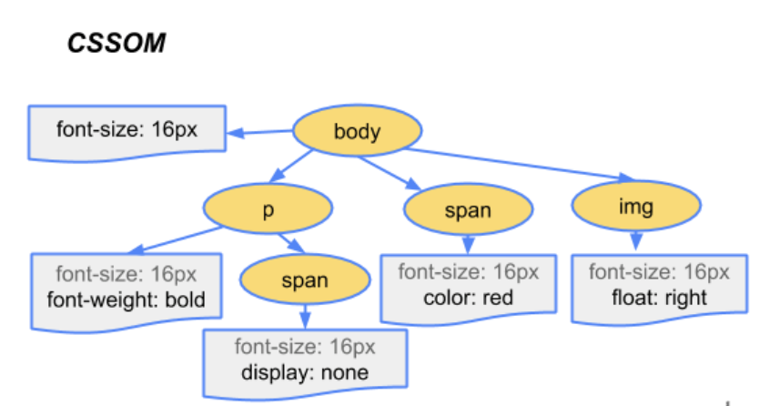
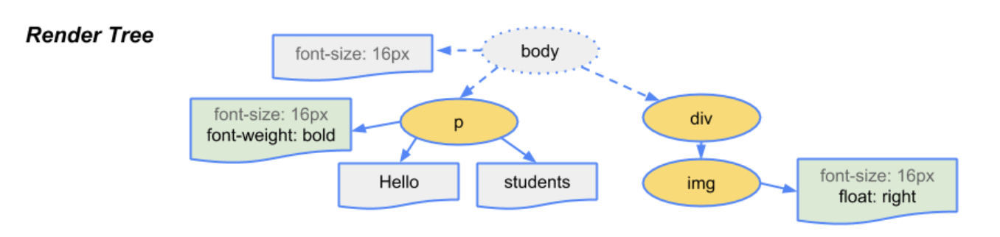
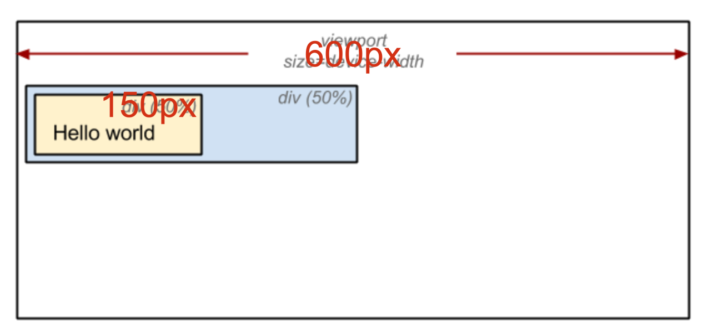
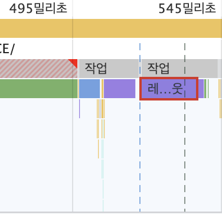
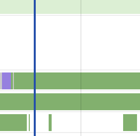
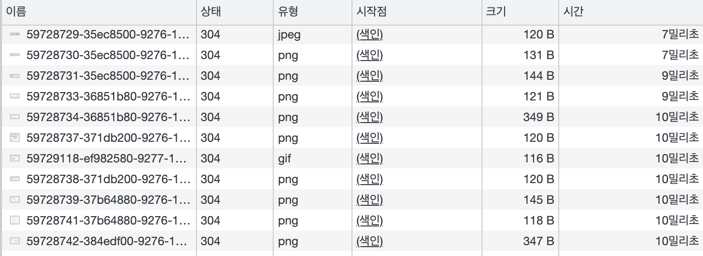
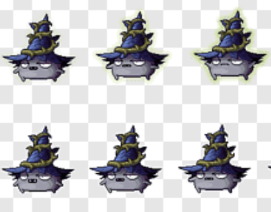

## 웹 성능 최적화란 무엇일까?

웹 개발을 하면서, 아.. 성능 최적화 해야하는데 이러한 고민을 해본적이 있을것이다. <br />
큰 규모의 프로젝트에서 <b>성능 최적화</b>는 굉장히 중요하다. <br />
최근 웹 개발은 ajax 통신, 화려한 UI등 많은 기능을 담으면서 점점 무거워 지고 있다. <br />
무거워진 웹은 긴 로딩 시간으로 UX에 안 좋은 영향을 끼친다. <br />
사용자의 불편함은 서비스 이탈에 있어, 치명적이므로 돌아보는 과정이 필요하다. <br />

먼저, 성능 최적화를 이해하기 위해서는 <b>브라우저의 로딩 과정</b>을 확인할 필요가있다.

### 브라우저 로딩 과정

브라우저는 웹 페이지에 필요한 리소스를 내려받고 해석한 다음 여러 계산 과정을 거쳐 콘텐츠를 화면에 보여준다. <br />
이러한 행위를 <b>브라우저의 로딩 과정</b>이라고 한다. <br />
(다운로드, 파싱, 스타일, 레이아웃, 페인트, 합성의 세부 단계) <br />

1.  <b>파싱</b> <br />
    브라우저는 웹 페이지를 로드하면 가장 먼저 html 파일을 <b>다운로드</b> 한다. <br />
    파싱은 <b>다운로드한 html을 해석해 DOM 트리를 구성</b>하는 단계이다. <br />
    파싱 중 `<script />, <link />, `를 발견하면 각 리소스를 요청하고 다운로드 한다. <br />
    html 또는 리소스에 CSS가 포함된 경우에는 CSSDOM 트리 구성 작업도 함께 진행한다. <br /><br />

    - DOM 트리 구성 <br />

    ```js
     // 다운로드한 html
     <!DOCTYPE html>
     <html lang="kr">
       <head>
         <meta name="viewport" content="width=device-width,initial-scale=1">
         <link href="style.css" rel="stylesheet">
         <title>Document</title>
       </head>
       <body>
         <p>Hello <span>web performance</span> students!</p>
         <div></div>
       </body>
     </html>
    ```

    다운로드한 html 파일을 보면, 파싱이 일어나면 html을 해석하여 DOM을 생성한다.<br />
    각 DOM 객체를 트리 데이터 구조로 연결해 부모-자식 관계를 갖도록 만든다. <br />
    `<body>, <p>, <div>`등 각 태그가 DOM 트리의 노드로 생성되고 자식 노드를 참조한다.<br />

    

    <h6>https://developers.google.com/web/fundamentals/performance/critical-rendering-path/constructing-the-object-model?hl=ko</h6><br />

    - CSSDOM 트리 구성 <br />

    ```js
    body { font-size: 16px }
    p { font-weight: bold }
    span { color: red }
    p span { display: none }
    img { float: right }
    ```

    다음과 같이 외부 스타일시트 파일이나 내부 스타일시트가 포함되어 있을 경우, css를 해석해 cssDOM 트리를 구성한다.<br />
    `<b>, <p>, <span>`등 선택자가 노드로 생성되고 각 노드는 스타일을 참조한다.<br />

    

    <h6>https://developers.google.com/web/fundamentals/performance/critical-rendering-path/constructing-the-object-model?hl=ko</h6><br />

2.  <b>스타일</b> <br />
    스타일 단계에서는 파싱 단계에서 생성된 DOM, CSSDOM 트리를 통해 스타일을 매칭시켜 랜더 트리를 구성한다. <br />
     <br />

    <h6>https://developers.google.com/web/fundamentals/performance/critical-rendering-path/constructing-the-object-model?hl=ko</h6><br />

3.  <b>레이아웃</b> <br />
    레이아웃 단계에서는 노드의 정확한 위치와 크기를 계산한다. <br />
    노드의 정확한 크기와 위치를 파악하기 위해 루트부터 노드를 순회하면서 계산하고, 레이아웃 결과로 각 노드의 정확한 위치와 <br />
    크기를 픽셀값으로 렌더트리에 반영한다. 아래는 레이아웃 전/후 과정을 보여준다. 만약 css에서 크기 값을 %로 지정하였다면, 레이아웃 단계를 거친 후 %값은 계산되고 측정 가능한 픽셀 단위로 변환된다.<br />
     <br />

4.  <b>페인트</b> <br />
    이전 레이아웃 단계에서 계산된 값을 이용해 렌더트리의 각 노드를 화면상의 실제 픽셀로 변환한다. <br />
    이때 위치와 관계없는 css속성(색상, 투명도 등)을 적용한다. 그리고 픽셀로 변환된 결과는 포토샵의 레이어처럼 생성되어 개별 레어로 관리된다. <br />
    단, 각각의 엘리먼트가 모두 레이어가 되는 것은 아니다. 이 과정을 페인트라고 한다. <br /><br />

5.  <b>합성 그리고 렌더</b> <br />
    페인트 단계에서 생성된 레이어를 합성하여 스크린을 업데이트한다. <br />
    합성과 렌더 단계가 끝나면 화면에서 웹 페이지를 볼 수 있다. <br /><br />

!! 지금까지 브라우저 로딩 과정 중 <b>렌더링</b>을 알아 보았다. (스타일 -> 레이아웃 -> 페인트 -> 합성)

### 레이아웃과 리페인트

 <br />

렌더링 과정은 상황에 따라 반복하여 발생할 수 있다. <br />
스타일 단계에서 구성되는 렌더 트리는 js에 의해 DOM트리, CSSDOM 트리가 변경될 때 재구성 된다. <br />
DOM이 추가/삭제되거나 요소에 <b>기하적인 영향</b>(높이, 넓이, 위치)를 주는 CSS 속성값을 변경하는 경우, 렌더 트리가 <b>재구성</b> 된다. <br />
즉, 레이아웃부터 이후 가정을 다시 수행하며 이것을 <b>레이아웃</b> 또는 <b>리플로우</b> 라고 한다.<br />

 <br />

레이아웃(리플로우)은 요소에 기하적인 영향을 주는 CSS 속성값을 변경할 때 발생한다고 하였는데, <br />
반대로 영향을 주지 않는 css 속성값을 변경하면 레이아웃 과정을 건너뛴다. 페인트과정 부터 수행하며 이를 <b>리페인트</b>라고 한다.<br />
레이아웃이 일어나면 전체 픽셀을 다시 계산해야 하므로 부하가 크다. <br />
반면 <b>리페인트</b>는 이미 계산된 픽셀값을 이용해 화면을 그리기 때문에 레이아웃에 비해 부하가 적다. <br />

#### 요소에 기하적인 영향을 주는 CSS 속성값

```js
myBox.style.width = '500px'
```

 <br />
!! 레이아웃(리플로우) 발생 <br />

CSS 속성값 : height, width, left, top, font-size, line-height 등 <br />

#### 요소에 기하적인 영향을 주지 않는 CSS 속성값

```js
myBox.style.backgroundColor = 'orange'
```

 <br />
!! 리페인트 발생 <br />
CSS 속성값 : background-color, color, visibility, text-decoration 등 <br />

#### 위와같이 레이아웃이 발생하면 실행 시간만큼 렌더링 시간도 늘어나게 된다. 따라서 불필요한 레이아웃(리플로우)이 발생하지 않도록 신경 써야 한다.

<br /><br />

---

<br /><br />
전까지 브라우저 로딩 과정하는 과정을 소개하였다. <br />

지금 부터 <b>웹페이지 로딩 최적화</b>에 대하여 알아보려고 한다. <br /><br /><br />

### 1) 블록 차단 및 리소스(CSS, 자바스크립트) 최적화

브라우저 로딩 과정에서 파싱 중 블록 리소스가 발생할 수 있으며, CSS와 자바스크립트가 블록 리소스에 해당한다고 했다. <br />
최적화의 첫 번째 단계는 이 블록 리소스를 최적화하는 것이다. <br />

```
  // plus +
  html 파서는 스크립트 태그를 만나면 dom 생성 프로세스를 중지하고 자바스크립트 엔진에 제어 권한을 넘긴다.
  자바스크립트 엔진의 실행이 완료된 후 브라우저가 중지했던 시점부터 dom 생성을 재개한다.
  다시말해, 요소가 아직 처리되지 않았기 때문에 스크립트 블록이 페이지의 뒷부분에서 어떠한 요소도 찾을 수 없게 된다.
```

1. <b>\* CSS 최적화</b><br />

   블록 차단 리소스는 곧 렌더링 차단 요소에 속한다.<br />
   렌더 트리를 구성하기 위해서는 DOM 트리와 CSSOM 트리가 필요하다.<br />
   DOM 트리는 파싱 중에 태그를 발견할 때마다 순차적으로 구성할 수 있지만, CSSOM 트리는 CSS를 모두 해석해야 구성할 수 있다.<br />
   즉, CSSOM 트리가 구성되지 않으면 렌더 트리를 만들지 못하고 렌더링이 차단된다.<br />
   이러한 이유로 CSS는 렌더링 차단 리소스라고 하며, 렌더링이 차단되지 않도록 CSS는 항상 HTML 문서 최상단(`<head> 아래`)에 배치한다.<br />

   ```html
   <!DOCTYPE html>
   <html lang="kr">
     <head>
       <link href="style.css" rel="stylesheet" />
       <title>Yes, React</title>
     </head>
   </html>
   ```

   그리고 특정 조건에서만 필요한 CSS가 있을 때 미디어 쿼리를 사용하면 불필요한 블로킹을 방지할 수 있다.<br />
   예를 들어 다음과 같이 페이지를 인쇄하거나(print.css) 화면이 세로 모드일 때(portrait.css) 사용하는 CSS가 있을 때,<br />
   해당 스타일을 사용하는 경우에만 로드할 수 있도록 `<script> 태그`에 media 속성을 명시하여 사용한다.<br />

   ```js
     <link href="style.css" rel="stylesheet">
     <link href="print.css" rel="stylesheet" media="print" >
     <link href="style.css" rel="stylesheet" media="width: 1024px">
     <link href="portrait.css" rel="stylesheet" media="orientation:portrait" />
   ```

   외부 스타일시트를 가져올 때 사용하는 @import 사용은 피한다.<br />
   아래와 같이 @import를 사용했을 때 브라우저는 스타일시트를 병렬로 다운로드 할 수 없기 때문에 로드 시간이 늘어날 수 있다.<br />

   ```js
    @import url("out.css");
   ```

2. <b>\* 자바스크립트 최적화</b><br /><br />
   자바스크립트는 DOM 트리와 CSSOM 트리를 동적으로 변경할 수 있기 때문에 HTML 파싱을 차단하는 블록 리소스이다.<br />
   `<script> 태그`를 만나면 스크립트가 실행되며 그 이전까지 생성된 DOM에만 접근할 수 있다.<br />
   그리고 스크립트 실행이 완료될 때까지 DOM 트리 생성이 중단된다.<br />
   외부에서 가져오는 자바스크립트의 경우에는 모든 스크립트가 다운로드되고 실행될 때까지 DOM 트리 생성이 중단된다.<br />
   이러한 이유로 자바스크립트도 렌더링 차단 리소스라고 하며, HTML 문서 최하단(`</body> 직전`)에 배치한다.<br />

   ```html
   <body>
     <div>Yes, React</div>
     <script src="react.js" type="text/javascript"></script>
   </body>
   ```

   만약 `<head> 아래`에 포함되어 있거나 HTML 내부에 `<script> 태그`가 포함되어 있을 때도 HTML 파싱을 멈추지 않게 할 수 있다.<br />
   `<script> 태그`에 defer나 async 속성을 명시하면 스크립트가 DOM 트리와 CSSOM 트리를 변경하지 않겠다는 의미이기 때문에<br />
   브라우저가 파싱을 멈추지 않는다.<br />
   단, 이 속성들은 브라우저 지원 범위가 한정적이므로 사용에 유의한다.<br />

   ```
    // plus +
    async: 스크립트 로드만 병력적으로 실행하므로 실행 순서를 보장할 수없다.
    defer: 병렬적으로 파일을 로드하면서 모든 dom이 로드된 후에 스크립트를 실행 하므로 실행 순서가 보장된다.
   ```

   <br />

### 2) 리소스 요청 수 줄이기

CSS, 자바스크립트, 이미지 등 웹 페이지에 포함된 리소스는 서버 요청 후 다운로드되어야 사용할 수 있다. <br />
리소스 파일 하나를 요청하는 데 많은 시간이 소요되므로, 필요한 요청만 할 수 있도록 최적화해야 한다.

 <br />

1. <b>\* 이미지 스프라이트</b><br /><br />

이미지 스프라이트는 여러 개 이미지를 하나로 만들고, CSS의 background-position 속성을 사용해 부분 이미지를 사용하는 방법이다.<br />
아래 CSS에서 사용된 sprite.png가 스프라이트 이미지다. 이 이미지 스프라이트 기법을 사용하면 웹 페이지를 보다 빨리 보여줄 수 있다.<br />

 <br />

```js
<button class="sprite">yes</button>
  .btn {
    background-image: url(../images/sprite.png);
    background-position: 20px 20px;
    width: 10px;
    height: 10px;
  }
```

2. <b>\* css, 자바스크립트 번들하기</b><br /><br />

모듈 기반의 개발 방식이 등장하기 이전까지 분리된 여러 개의 리소스 파일을 가져와 사용했었다.<br />
아래 최적화 하기 전 예제를 살펴보면, 5번 이상의 리소스 요청(CSS 파일 2번, 자바스크립트 파일 3번)이 발생한다.<br />
이 경우에는 webpack과 같은 번들러를 사용하여 CSS, 자바스크립트 파일 요청을 줄일 수 있다.<br />
번들러는 여러 개의 모듈 파일을 하나로 묶어서 1개 파일로 생성해주는데 이것을 번들 파일이라고 한다.<br />
이 번들 파일을 사용하여 리소스 요청을 줄일 수 있다.<br />

```html
// 번들전
<html>
  <head>
    <link href="style1.css" rel="stylesheet" />
    <link href="style2.css" rel="stylesheet" />
  </head>
  <body>
    <div id="root">...</div>
    <script async src="react1.js" type="text/javascript"></script>
    <script async src="react2.js" type="text/javascript"></script>
    <script async src="react3.js" type="text/javascript"></script>
  </body>
</html>
```

```html
// 번들후
<html>
  <head>
    <link href="bundle.css" rel="stylesheet" />
  </head>
  <body>
    <div id="root">...</div>
    <script async src="bundle.js" type="text/javascript"></script>
  </body>
</html>
```

3. <b>\* 내부 스타일시트 사용하기</b><br /><br />

`<link> 태그`로 외부 스타일시트를 가져오는 대신, 문서 안에서 `<style> 태그`를 사용할 수 있다.<br />
이러한 사용 방법을 내부 스타일시트라고 하며, 외부 스타일시트를 가져올 때 발생하는 요청 횟수를 줄일 수 있다.<br />
단, 내부 스타일시트를 사용하면 리소스 캐시를 사용할 수 없어서 HTML에 CSS가 매번 포함되므로 필요한 경우에만 사용한다.<br />

```js
  <html>
    <head>
      <style type="text/css">
        .box {
          background-color: orange;
        }
      </style>
    </head>
    <body>
      <div class="box">...</div>
    </body>
  </html>
```

4. <b>\* 내부 스타일시트 사용하기</b><br /><br />

웹 페이지에서 사용하는 아이콘 이미지 개수가 적은 경우, 다운로드한 이미지를 사용하는 대신 이미지를 HTML, CSS에 포함해 사용할 수 있다.<br />
Data URI로 처리할 수 있으며, 다음과 같이 HTML, CSS에서 외부 경로로 이미지를 가져오던 부분을 Base64로 변환된 URI로 대체한다.<br />
이렇게 하면 외부 이미지를 사용하기 위해 발생하는 요청 횟수를 줄일 수 있다.<br />
이 경우도 내부 스타일시트를 사용했을 때와 같이 캐시 문제가 있으므로 필요한 경우에만 사용한다.<br />

```css
  .btn{background: url('data:image/png;base64...') no-repeat 0 0;}
  
```

### 3) 리소스 용량 줄이기

용량이 큰 리소스도 웹 페이지 로딩 시간을 느리게 하는 원인이 된다. <br />
각 리소스에 맞게 불필요한 데이터를 제거하고 압축하여 사용하는 것이 좋다.

1. <b>\* 중복 코드 제거</b><br /><br />

```js
// common.js
export function sleep() { ... }

// react1.js
import { sleep } from 'common.js'
sleep();

// react2.js
import { sleep } from 'common.js'
sleep();
```

2. <b>\* 만능 유틸 사용 주의하기</b><br /><br />

lodash와 같은 만능 유틸 라이브러리를 사용할 때 주의한다.<br />
일반적인 방식으로 가져와 사용하면 유틸 함수 전체가 포함되므로 자바스크립트 파일 용량이 커진다.<br />
이 경우에 필요한 함수만 부분적으로 가져올 수 있으며 용량이 늘어나는 문제를 해결해준다.<br />
그리고 되도록 사용하지 않는 기능이 많이 포함된 라이브러리 사용은 지양한다<br />

```js
import isEmpty from 'lodash/isEmpty'

isEmpty(null)
```

2. <b>\* HTML 마크업 최적화</b><br /><br />

HTML은 태그의 중첩을 최소화하여 단순하게 구성한다. <br />
또한 공백, 주석 등을 제거하여 사용한다. 권장하는 DOM 트리의 노드 수는 전체 1500개 미만, 최대 깊이는 32개, 자식 노드를 가지는 부모 노드는 60개 미만이다.<br />
불필요한 마크업 사용으로 인해 DOM 트리가 커지는 것을 막고, HTML 파일 용량이 늘어나지 않도록 해야 한다.<br />

3. <b>\* 간결한 CSS 선택자 사용</b><br /><br />

스타일을 적용할 때 간결한 CSS 선택자를 사용해 최적화한다.<br />
ID 대신 클래스 선택자를 사용하면 중복되는 스타일을 묶어서 처리할 수 있다.<br />
선택자는 최소화여 사용한다<br />

4. <b>\* 압축(Minify)하여 사용하기</b><br /><br />

HTML, 자바스크립트, CSS 모두 압축해서 사용할 수 있으며, 불필요한 주석이나 공백 등을 제거한 다음 난독화하여 사용한다. <br />
webpack 플러그인과 같은 도구로 처리할 수 있다. <br />
