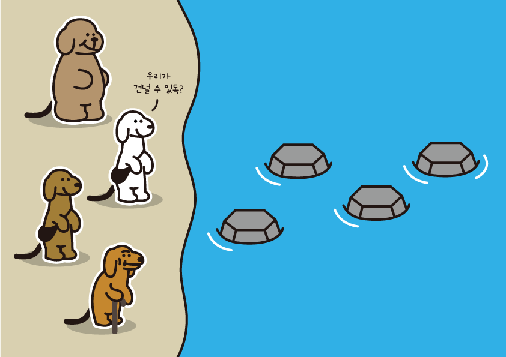

## 문제 02 JAVA독 생존자 구하기!



저기 징검다리가 보이지? 내 친구들이 징검다리를 건널거야! 하지만 징검다리는 버틸수 있는 내구도가 한계가 있지! 내 친구들의 **몸무게**, **돌의 내구도**, **친구들의 점프력**을 고려하여 내 친구 루비독, 피치피독, 씨-독, 코볼독이 각각 다리를 건널 수 있는지 알아봐줘! 친구들은 더 추가 될 수도, 덜 건널 수도 있어!

1. 각 돌들이 얼마나 버틸수 있는지 배열로 주어집니다. (내구도 0이 되면 독은 살아남지 못합니다.)

2. 각 독들의 개인정보가 JSON으로 주어집니다.

3. 각 돌에 독들이 착지할 때 돌의 내구도는 몸무게만큼 줄어듭니다.
   ex) [1,2,1,4] 각 돌마다 몸무게 1인 독 1마리 2마리 1마리 4마리의 착지를 버틸 수 있습니다.
   (문제의 오류인거 같다. 내가 생각한 출력값과 달라서 예시답안을 보니 돌의 내구도가 0이하가 되어도 돌이 가라앉지 않는다. 즉 돌은 계속
   살아있음)

4. 독들의 점프력이 각자 다릅니다.
   ex) 점프력이 2라면 2칸씩 점프하여 착지합니다.

5. 각 독들은 순서대로만 다리를 건넙니다.

#### 제공 data

stoneDurability = [1, 2, 1, 4] <br />
dogs = [{
"이름" : "루비독",
"나이" : "95년생",
"점프력" : "3",
"몸무게" : "4",
},{
"이름" : "피치독",
"나이" : "95년생",
"점프력" : "3",
"몸무게" : "3",
},{
"이름" : "씨-독",
"나이" : "72년생",
"점프력" : "2",
"몸무게" : "1",
},{
"이름" : "코볼독",
"나이" : "59년생",
"점프력" : "1",
"몸무게" : "1",
},
]

=> 출력 : ['씨-독']

---

```jsx
1. 문제파악 : 출력값 ['씨-독']이다
2. 순서대로 건너며 점프력에 따른 착치위치가 다르다 또한 착치순간 돌의내구도가 몸무게 보다 낮으면 빠져 죽는다.

let stoneDurability = [1, 2, 1, 4]
let dogs = [{
"이름" : "루비독",
"나이" : "95년생",
"점프력" : "3",
"몸무게" : "4",
},{
"이름" : "피치독",
"나이" : "95년생",
"점프력" : "3",
"몸무게" : "3",
},{
"이름" : "씨-독",
"나이" : "72년생",
"점프력" : "2",
"몸무게" : "1",
},{
"이름" : "코볼독",
"나이" : "59년생",
"점프력" : "1",
"몸무게" : "1",
},
]
function resultFn(stoneDurability, dogs) {
  // 내구도와 dog정보를 넘겨받는다
  let answer = [];
  // 각 원소를 순회하는 for of 문 사용
  for (let item of dogs) {
    let dogLocation = 0;
    let failResult = false
    while (dogLocation < stoneDurability.length -1) {
        dogLocation += parseInt(item['점프력'],10)
        stoneDurability[dogLocation -1] -= parseInt(item['몸무게'],10)
        if (stoneDurability[dogLocation -1] <0) {
            failResult = true
            break
        }
    }
    if (!failResult) {
        answer.push(item["이름"]);
    }

  }
  return answer;
}
console.log(resultFn(stoneDurability, dogs));

```
