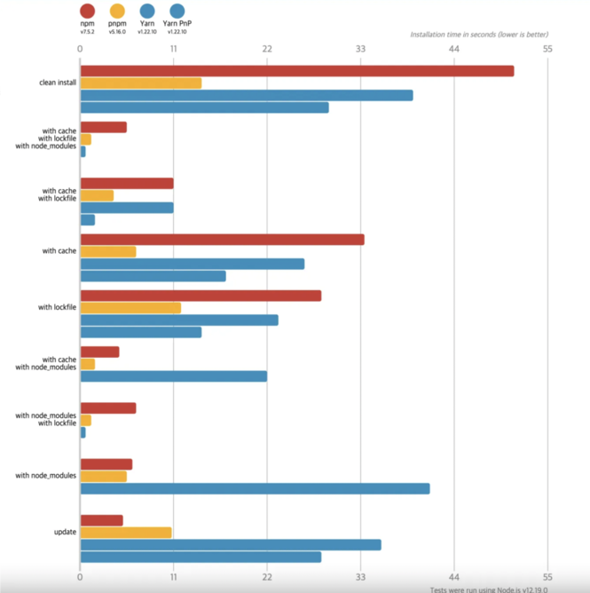

 

사이드프로젝트를 진행하며 pnpm을 사용해 모듈들을 관리해볼 기회가 생겨  
오랜만에 대표적인 패키지 매니저 npm pnpm yarn을 빠르게 정리해보려고 한다.   

기본적으로 패키지 매니저(Package Manager)라고 하면 패키지를 다루는 작업을 
편리하고 안전하게 수행하기 위해 사용되며 여러 패키지를 설치, 업데이트, 수정, 삭제하는 작업과 각 패키지간의 의존성을 관리해주는 역활을 한다.  

대표적으로 npm, yarn, pnpm을 뽑아 본다.   

먼저 `npm`은 2010년에 등장하였다. 
NODE JS 환경에서 사용할 수 있는 모듈들을 패키지화 하여 모아둔 저장소의 역활과 설치 및 관리를 위한 CLI를 제공한다. 
서비스를 개발하다보면 많은 패키지를 사용하게 되고 패키지간 서로 사용하며 버전이 업데이트 된다면  
의존성을 수동으로 다운로드 해야했던 불편함을 혁신적으로 개선한 패키지 매니저의 시초이다.  
메타데이터 필드(예: devDependencies)가 포함된 package.json 파일, node_modules에 의존성 저장,  
사용자 지정 스크립트, 공용 및 개인 패키지 레지스트리 등의 모든 개념은 npm에 의해 도입 되었다.  

`yarn`은 npm이 당시에 가지고 있던 일관성, 보안 및 성능 문제와 관련된 문제를 
해결할 새로운 패키지로 등장하게 되었다. 크게 아래 3가지 컨셉을 주로 삼는다. 

<b>고속</b> 
다운로드한 모든 패키지를 캐시하므로 다시 다운로드할 필요가 없다. 
또한 운영을 병렬화하여 리소스 활용률을 극대화하므로 설치 시간이 그 어느 때보다 단축된다.  
<b>보안</b> 
체크섬을 사용하여 코드가 실행되기 전에 설치된 모든 패키지의 무결성을 확인한다.  
<b>신뢰성</b> 
상세하고 간결하며 잠금 파일 형식과 설치용 결정 알고리즘을 사용하여 
한 시스템에서 작동하는 설치가 다른 시스템에서 정확히 동일한 방식으로 작동하도록 보장할 수 있다.   

`pnpm`은 npm 으로 여러 프로젝트를 관리하다보면, 여러 프로젝트에서 모두 같은 의존성을 사용하는 경우가 있다. 
이를테면 react 프로젝트 100개가 로컬에 있을 수 있다.
이 때, 기존의 npm 이나 yarn 으로 프로젝트를 관리하는 경우에는 100개의 프로젝트 내부의 node_modules 디렉토리에 각각 리액트 라이브러리를 모두 설치한다.  결과적으로 로컬 하드 디스크에는 실질적으로 똑같은 파일이 100 copy 가 설치되는 것이다. 
반면 pnpm 은 content-addressable file store 라는 것을 이용해 문제를 해결한다. 
단순하게 파일 이름으로 해당 파일을 접근하는 것이 아니라 git 에서 커밋에 hash id 를 부여하듯 각각의 의존성 파일에 hash id 를 부여하고 관리한다.  
이 과정에서 중복되는 패키지는 동일한 hash id 를 얻게 된다. 
pnpm 은 홈디렉토리의 글로벌 저장소인 ~/.pnpm-store 에 모든 패키지를 저장하는 저장소를 두고, 중첩된 패키지는 단 한번만 설치한다. 
중복된 의존성에서 같은 패키지를 사용하는 경우에는 파일을 중복으로 설치하는 대신 이 주소를 이용하여 hard link 를 만들어 연결해준다.   

 
벤치마크 패키지매니저: 
https://github.com/pnpm/benchmarks-of-javascript-package-managers 

요약: 
`npm` Node.js 환경에서 사용할 수 있는 모듈들을 패키지화 하여 모아둔 저장소의 역할과 설치 및 관리를 위한 CLI를 제공한다. 
의존성을 수동으로 다운로드하는 불편함을 개선한 패키지 매니저 
`yarn` npm이 가지고 있던 문제점을 해결하기 위해 Facebook에서 개발한 패키지 매니저  
다운로드한 모든 패키지를 캐시하므로 다시 다운로드할 필요가 없으며 운영을 병렬화하여 리소스 활용률을 극대화하므로 설치 시간이 단축된다. 
`pnpm` npm으로 여러 프로젝트를 관리하다보면, 여러 프로젝트에서 모두 같은 의존성을 사용하는 경우가 있는데, 이를 효율적으로 관리하기 위한 패키지 매니저 
중복된 패키지를 한 번만 설치하여 로컬 하드 디스크 공간을 절약 
