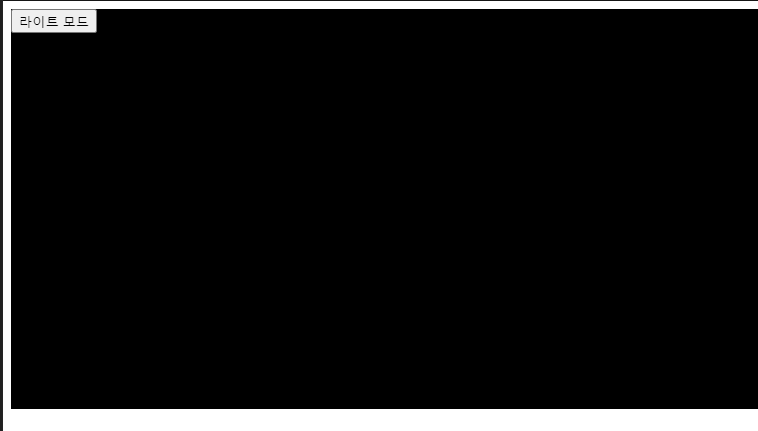

요즘 다크모드가 유행인가보다.... 리액트 커스텀 hooks로 theme를 빼서 만들어보장

```tsx
// darkmode.tsx
import { useEffect, useState, useCallback } from 'react'

export default () => {
  const [theme, setTheme] = useState<string>('light')

  // 테마를 지정하는 점을 기점으로 새로고침 또는 URL 이동을 하더라도 테마가 유지되야할것.
  // 고민을 하다가 로컬스토리지를 사용하기로 했다. 새로고침 뿐만아니라 ux를 신경써 다음에 웹을 방문
  // 하더라도 재설정에 대한 클라이언트의 피로를 덜하기 위험이다.

  const toggleTheme = useCallback((): void => {
    if (theme !== 'dark') {
      localStorage.setItem('theme', 'dark')
      setTheme('dark')
    } else {
      localStorage.setItem('theme', 'light')
      setTheme('light')
    }
  }, [theme])

  useEffect(() => {
    const localTheme = localStorage.getItem('theme')
    if (localTheme) {
      // 사용자의 선택 테마환경 초기세팅
      setTheme(localTheme)
    }
  }, [])

  // 환경을 변경할수 있는 토글function 과 theme 상태값을 export
  return {
    theme,
    toggleTheme,
  }
}
```

```tsx
// index.tsx
import React from 'react'
import useTheme from './darkmode'
import './main.scss'
const Main = function() {
  const { theme, toggleTheme } = useTheme()
  // theme 상태값과 toggle 함수 객체분해
  return (
    <div className={`main_Container ${theme}`}>
      <button type="button" onClick={toggleTheme}>
        {theme === 'dark' ? '라이트 모드' : '다크 모드'}
      </button>
    </div>
  )
}
```

```scss
.main_Container {
  width: 100vw;
  min-height: 400px;
  background: lightGray;
  &.dark {
    background: black;
  }
  &.light {
    background: lightGray;
  }
}
```

구현


버튼 클릭시



페이지를 벗어나거나 새로고침시 로컬스토리지로 인한 초기값세팅으로 다크모드유지


