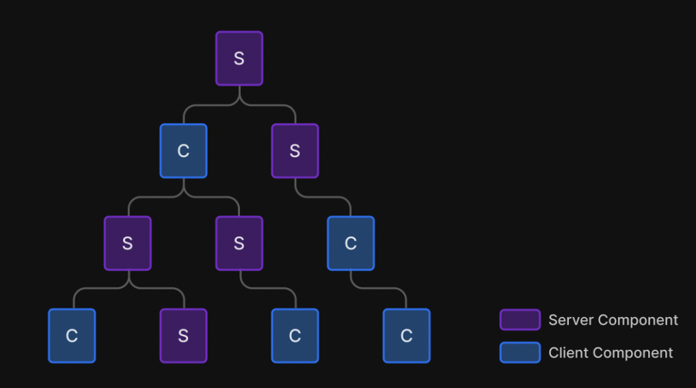
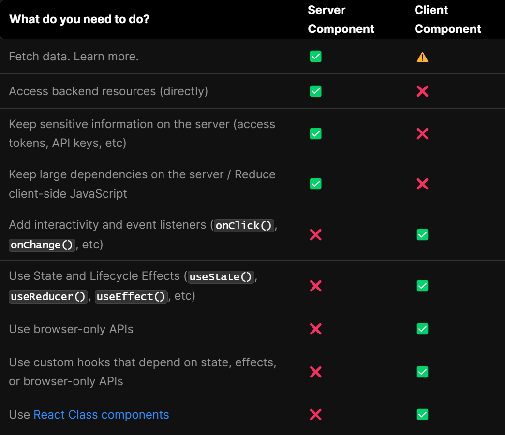

### Rendering Environments

어플리케이션 코드를 렌더링할 수 있는 환경에는 두 가지 환경이 있다. 바로 클라이언트와 서버이다. <br>

<b>클라이언트</b>

어플리케이션 코드에 대한 요청을 서버로 보내는 유저 디바이스의 브라우저를 말한다.<br>
그런 다음 서버의 응답을 사용자가 상호 작용할 수 있는 인터페이스로 변환한다.<br>

<b>서버</b>

서버는 어플리케이션 코드를 저장하고, 클라이언트의 요청을 수신하고,<br>
일부 computation을 수행한 후 적절한 응답을 보내는 data center의 컴퓨터를 말한다.<br>

### Component-level Client and Server Rendering

React 18 버전 이전까지는 React를 사용하여 어플리케이션을 렌더링하는 주요한 방법이 "전적으로" <b>클라이언트</b>에 있었다.<br />
(Before React 18, the primary way to render your application using React was entirely on the client.)<br />

Next.js는 HTML을 생성하고 React에 의해 hydrated 되도록 클라이언트에 전송함으로써 어플리케이션을 pages로 나누고 서버에서 prerender하는<br />
더 쉬운 방법을 제공했다. 하지만, 이것은 initial HTML을 인터랙티브하게 만들기 위해서 추가적인 JavaScript를 필요로 하게 만들었다.<br />

<b>Hydration이란?</b>

Hydration turns the initial HTML snapshot from the server into a fully interactive app that runs in the browser.<br />
즉, 서버 측에서 생성된 정적 HTML 마크업을 브라우저에서 동적인 React 앱으로 만들어주는 것입니다.<br />

그러나, 이제부터는 서버 컴포넌트 및 클라이언트 컴포넌트를 사용하여 클라이언트 또는 서버에서 React를 렌더링할 수 있게 되었다.<br />
즉, 이제부터는 <b>컴포넌트 수준</b>에서도 렌더링 환경(rendering environment)를 선택할 수 있게 된 것이다.<br />

<b>Next.js 13 버전부터는 기본적으로 app directory는 서버 컴포넌트를 사용</b>하므로 서버에서 컴포넌트를 쉽게 렌더링하고<br />
클라이언트로 전송되는 JavaScript의 양을 줄일 수 있게 되었다.<br />

서버 컴포넌트와 클라이언트 컴포넌트를 Component Tree에서 interleave 할 수 있는데, 방법은 다음 두 가지가 있다.<br />

Server component 안에서 Client component를 import해서 사용하기<br />
Client Component의 child나 prop으로 Server component를 전달하기<br />

React will merge the work of both environments behind the scenes!<br />

 <br />

```
성능을 향상시키고 싶다면?

가능하면 Client Components를 Component Tree의 맨 아래쪽에 오도록 이동시키는 것이 좋다.

예를 들어, logo, links 등과 같은 정적 요소(static elements)와 state를 사용하는 인터랙티브한 요소인 search bar를 포함하는
Layout이 있다고 하자.

여기서 전체 Layout을 Client Component로 만드는 대신 인터랙티브 로직을 Client Component로 따로 분리하고 (e.g. 로 따로 분리)
전체 레이아웃은 Server Component로 유지한다.
그렇게 되면 Layout의 모든 component의 JavaScript를 클라이언트로 보내지 않아도 되고, 성능은 향상 될 것이다.

// ex. app/layout.js
// SearchBar is a Client Component
import SearchBar from './SearchBar';
// Logo is a Server Component
import Logo from './Logo';
// Layout is a Server Component by default
export default function Layout({ children }) {
  return (
    <>
      <nav>
        <Logo />
        <SearchBar />
      </nav>
      <main>{children}</main>
    </>
  );
}
```

### Server and Client Components

<b>Server Components</b>

Next.js 13 버전의 app directory 안에 있는 모든 컴포넌트들은 기본적으로 React Server Component이다. <br />
따라서, 추가적인 작업 없이 자동적으로 Server Components를 채택할 수 있으며, 이는 뛰어난 성능으로 이어진다.<br />

<b>Why Server Components?</b>

React Server Components를 사용하면 개발자가 서버 인프라를 더 잘 활용할 수 있게 된다.<br />
예를 들어, 이전에 클라이언트의 자바스크립트 번들 크기에 영향을 미쳤던 large dependencies가 서버에 대신 남아 성능을 향상시킬 수 있다.<br />

경로가 Next.js로 로드되면 initial HTML이 서버에 렌더링된다.<br />
그런 다음, 이 HTML은 브라우저에서 점진적으로 향상(progressively enhanced)되어 <br />
클라이언트가 Next.js 및 React 클라이언트 측 런타임을 비동기적으로 로드함으로써 어플리케이션을 take over하고 interactivity를 추가할 수 있다.<br />

`Server Component`를 사용하면 initial page load가 더욱 빨라지고, client-side의 JavaScript 번들 사이즈가 줄어든다.<br />
Base client-side runtime은 캐시가 가능하고, 크기가 예측 가능하며, 어플리케이션이 커져도 증가하지 않는다. <br />
Additional JavaScript는 오직 클라이언트 컴포넌트를 통해 어플리케이션에서 client-side interactivity가 사용될 때만 추가된다.<br />

`Client Components`는 어플리케이션의 client-side interactivity를 추가할 수 있게 해준다.<br />
Next.js에서는 서버에서 prerendering되고 client에서 hydrate된다. <br />
클라이언트 컴포넌트는 Next.js 12 및 이전 버전 (즉, pages/ 디렉토리)가 작동한 방식으로 생각할 수 있다. <br />

<b>Convention</b>

만약 클라이언트 컴포넌트로써 사용하고 싶다면 파일의 최상단에 'use client'라는 directive를 써주면 된다.<br />
또한, 굳이 app/ 디렉토리에 위치할 필요 없이 클라이언트 컴포넌트는 아무 위치에나 존재할 수 있는데,<br />
app/ 디렉토리에 page들과 같이써도 상관 없다.<br />

### When to use Server vs. Client Components?

 <br />

### Importing Server Components into Client Components

앞에서 말했듯이 서버 컴포넌트와 클라이언트 컴포넌트는 같은 Component tree 안에 interleaved 될 수 있다. <br />
React가 알아서 merge 해 줄 것이다. <br />

그러나 React에서는 서버 컴포넌트를 클라이언트 컴포넌트 내부로 import하는 것에 제한이 있는데, <br />
왜냐하면 서버 컴포넌트에는 서버 전용 코드 (ex. 데이터베이스 또는 파일 시스템 유틸리티)가 있을 수 있기 때문이다. <br />

예를 들어 다음과 같이 클라이언트 컴포넌트 안으로 서버 컴포넌트를 import하는 것은 불가능하다. <br />

```javascript
'use client'
// ❌ This pattern will not work. You cannot import a Server
// Component into a Client Component
import ServerComponent from './ServerComponent'

export default function ClientComponent() {
  return (
    <>
      <ServerComponent />
    </>
  )
}
```

대신에, 우리는 서버 컴포넌트를 클라이언트 컴포넌트에 child나 prop으로써 넘겨줄 수 있다.<br />
이러한 방법은 해당 서버 컴포넌트와 클라이언트 컴포넌트를 다른 서버 컴포넌트로 감싸서 수행할 수 있다.<br />

app/ClientComponent.jsx<br />

```javascript
'use client'

export default function ClientComponent({ children }) {
  return <>{children}</>
}
```

app/page.js<br />

```javascript
// ✅ This pattern works. You can pass a Server Component
// as a child or prop of a Client Component.
import ClientComponent from './ClientComponent'
import ServerComponent from './ServerComponent'

// Pages are Server Components by default
export default function Page() {
  return (
    <ClientComponent>
      <ServerComponent />
    </ClientComponent>
  )
}
```

이러한 패턴을 사용하면 React는 (서버 전용 코드가 포함되지 않은)결과를 클라이언트에 보내기 전에 서버에서 렌더링해야 한다는 것을 알 수 있게 된다. <br />클라이언트 컴포넌트의 관점에서 자식 컴포넌트는 이미 렌더링되어있다.<br />
(From Client Component's perspective, its child will be already rendered.)<br />
이 패턴은 child prop이 있는 layouts과 pages에 이미 적용되어 있으므로 wrapper 컴포넌트를 추가로 작성할 필요는 없다.<br />

### Passing props from Server to Client Components (Serialization)

Props passed from the Server Components to Client components need to be serializable! <br />

Serialization <br />
object(객체) 또는 data structure가 네트워크 또는 스토리지를 통한 전송에 적합한 형식으로 변환되는 프로세스를 말한다.<br />
(ex. in an array buffer or file format)<br />

예를 들어, JavaScript에서 JSON.stringify()를 통해서 객체를 JSON string으로 serialize 할 수 있다. <br />

즉, functions, Dates 등과 같은 value들은 클라이언트 컴포넌트로 바로 직접적으로 넘겨줄 수 없다는 말이다. <br />
(클라이언트 컴포넌트에 props로 넘기지 않을거라면 굳이 serizlie 해 줄 필요는 없다.) <br />

### Third-party packages

use client 지시문은 서버 컴포넌트의 일부로 도입된 React의 새로운 기능이다.<br />
서버 컴포넌트 자체가 지금 너무나도 새로운 개념이기 때문에,<br />
서드파티 패키지들은 useState, useEffect 및 createContext와 같은 클라이언트 전용 기능을 사용하는 컴포넌트들에<br />
use client 지시문을 추가하기 시작했다.<br />

하지만, npm packages에 있는 클라이언트 전용 기능을 사용하는 많은 컴포넌트들은 아직까지 use client 지시문을 포함하고 있지 않다.<br />
그래서 이것들을 내 프로젝트의 클라이언트 컴포넌트 내부에서 import해서 사용한다면 별 문제가 없겠지만,<br />
서버 컴포넌트로 동작하는 곳에다가 import를 해서 사용한다면 제대로 작동하지 않고 오류를 일으킬 것이다.<br />
왜냐하면, Next.js가 해당 서드파티 컴포넌트가 클라이언트 전용 기능을 사용하고 있는 지 모르기 때문이다.<br />
이를 해결할 수 있는 방법은, 해당 클라이언트 전용 기능을 사용하는 서드파티 컴포넌트를 따로 client component를 만들어서<br />
import한 다음에 그걸 다시 export 시켜주는 것이다. 예를 들어, 다음과 같이 작성한다.<br />

app/carousel.jsx <br />

```javascript
'use client'

import { AcmeCarousel } from 'acme-carousel'

export default AcmeCarousel
```

이제 우리는 <Carousel />을 서버 컴포넌트 안에서 직접적으로 사용할 수 있다. <br />

app/page.js <br />

```javascript
import Carousel from './carousel'

export default function Page() {
  return (
    <div>
      <p>View pictures</p>

      {/_ 🟢 Works, since Carousel is a Client Component _/}
      <Carousel />
    </div>
  )
}
```

참고: <br />
https://beta.nextjs.org/docs/rendering/fundamentals
https://react.dev/blog/2022/03/29/react-v18
https://velog.io/@timosean/Server-component-vs.-Client-Component
