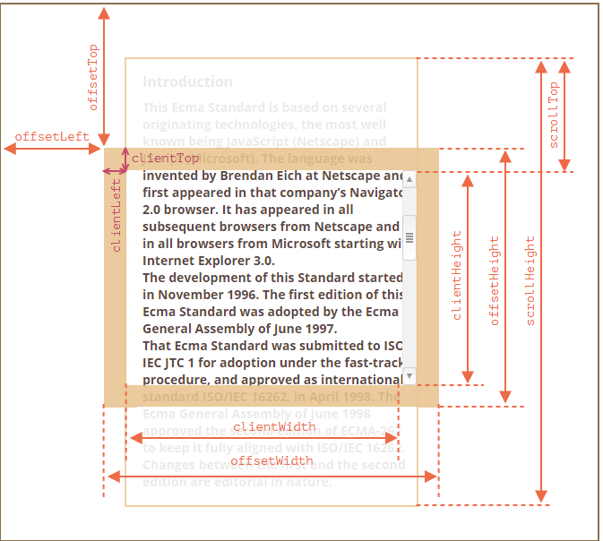

## 무한스크롤링 구현

- JSON TYPE 의 데이터 예시

```sh
data: {
    list:[
        {
            key: 0,
            name:'John',
            profImg: {
                path: "/profile/20941689600/20210118102547112899.jpeg",
                url: "https://image.google.com/profile/20941689600/20210118102547112899.jpeg"
            },
            title:'youTube mukBang'
        },
        ...
    ],
    paging:{
        next: 2
        page: 1
        prev: 0
        records: 10
        total: 3
        totalPage: 1
    }
}
```

> 먼저, 스크롤링의 핵심은 바닥에 닿는 순간을 캐치하고
> <br /> 적절한 상황에 이벤트를 발생시키는 것

- scroll 및 width 대한 이해

  

사용하는 컴포넌트마다 타이밍 또는 요구하는 DIFF가 다르겠지만 <br /> 범용성이 크기때문에 공통함수로 export 하는게 좋을 것 같다.

```sh
export const detectWindowBottom = () => {
  const windowHeight = "innerHeight" in window ? window.innerHeight : document.documentElement.offsetHeight;
  const body = document.body;
  const html = document.documentElement;
  const docHeight = Math.max(body.scrollHeight, body.offsetHeight, html.clientHeight, html.scrollHeight, html.offsetHeight);
  // 현재 보이는 브라우저의 높이중 가장 높은 값
  const windowBottom = windowHeight + window.pageYOffset;
  // 브라우저 높이와 y축 스크롤 이동 거리를 합한 값
  const diff = 300;

  return windowBottom >= docHeight - diff (크거나 같아지는 타이밍!!);
};
```

1. page의 상태관리와 현재 페이지의 값 비교를 위한 state 와 전역변수 선언
2. 리스트를 담을 state 선언

```sh
interface ListType {
  key: number;
  title: string;
  name: string;
  profImg: any;
}
let totalPage = 1; //전역 변수로 지정
const [currentPage, setCurrentPage] = useState<number>(1);
const [list, setList] = useState<ListType[]>([]);
```

> 데이터를 담아보자 !<br />
> 각 개발환경마다 DATA 통신 환경이 다르므로 fetch부분은 개발환경에 맞게..

```sh
  const fetchDataList = useCallback(async () => {
    const res = await getList({
      id: 'exampleId'
      page: currentPage,
      records: 30,
    });
    if (res.result === "success") {
      if (currentPage > 1) {
        setList(list.concat(res.data.list));
          // currentpage의 값에 따라 다음 리스트를 기존의 리스트에 붙이는 작업.
      } else {
        setList(res.data.list);
          // 초기 리스트 세팅
      }
      if (res.data.paging) {
        totalPage = res.data.paging.totalPage;
        // 위의 JSON 타입에서 이미 리스트의 totalpage를 받아서 리스트의 끝을 확인할 수 있다.
      }
    } else {
     alert('통신 실패 !!')
    }
  }, [currentPage]);
```

> 상황에 따른 currentPage를 변화 시키자

```sh
  const scrollEvtHdr = (fetching: boolean) => {
    if (totalPage > currentPage && detectWindowBottom()) {
        // totalPage 보다 현재의 페이지가 작아야하며 바닥에 닿거나 diff 조건을 만족해야한다
      if (!fetching) {
          // 또한 데이터 fetch가 발생되지 않는경우에 현재의 page상태를 변경 시켜줘야한다
        setCurrentPage(currentPage + 1);
      }
    }
  };
```

> 스크롤 이동시 0.05초 간격으로 scrollEvtHdr 이벤트를 발생시키되

```sh
export const checkBounce = (callback: Function, delay: number) => {
let timeout: number;

return (...args: any[]) => {
    const later = () => {
        clearTimeout(timeout);
        callback(...args); // ..args is an event
    };
    clearTimeout(timeout);
    timeout = setTimeout(later, delay);
    };
};
```

> SideEffect 를 통한 스크롤 event 삽입과 소멸

```sh
useEffect(() => {
    let fetching = false;
    window.addEventListener(
      "scroll",
      checkBounce(() => scrollEvtHdr(fetching), 50)
    );
    fetchDataList();
    return () => {
      window.removeEventListener(
        "scroll",
        checkBounce(() => scrollEvtHdr(fetching), 50)
      );
      fetching = true;
    };
  }, [currentPage]);
```

> conetents 렌더링

```sh
    return (
        <ul>
        {list.map((listItem,listIdx)=> {
            const {key,profImg,title} = listItem
            return (
                <li key={`리스트 + ${listIdx}`}>
                    
                    <h4>{title}</h4>
                    <span>
                        {name}
                    </span>
                </li>
            )
        })}
        </ul>
    )
```

> 최종소스

```js
//idex.tsx
import React, { useState, useEffect, useCallback } from 'react'
import { detectWindowBottom, checkBounce } from 'lib/common_fn'

interface ListType {
  key: number;
  title: string;
  name: string;
  profImg: any;
}

let totalPage = 1;

export default function Index() {

const [currentPage, setCurrentPage] = useState<number>(1);
const [list, setList] = useState<ListType[]>([]);

 const fetchDataList = useCallback(async () => {
    const res = await getList({
      id: 'exampleId'
      page: currentPage,
      records: 30,
    });
    if (res.result === "success") {
      if (currentPage > 1) {
        setList(list.concat(res.data.list));
      } else {
        setList(res.data.list);
      }
      if (res.data.paging) {
        totalPage = res.data.paging.totalPage;
      }
    } else {
     alert('통신 실패 !!')
    }
  }, [currentPage]);

    const scrollEvtHdr = (fetching: boolean) => {
    if (totalPage > currentPage && detectWindowBottom()) {
      if (!fetching) {
        setCurrentPage(currentPage + 1);
      }
    }
  };

  useEffect(() => {
    let fetching = false
    window.addEventListener(
      'scroll',
      checkBounce(() => scrollEvtHdr(fetching), 50)
    )
    fetchDataList()
    return () => {
      window.removeEventListener(
        'scroll',
        checkBounce(() => scrollEvtHdr(fetching), 50)
      )
      fetching = true
    }
  }, [currentPage])
  return (
    <ul>
      {list.map((listItem, listIdx) => {
        const { key, profImg, title } = listItem
        return (
          <li key={`list + ${listIdx}`}>
            
            <h4>{title}</h4>
            <span>{name}</span>
          </li>
        )
      })}
    </ul>
  )
}
```

```js
// lib/common_fn
export const detectWindowBottom = () => {
  const windowHeight =
    'innerHeight' in window
      ? window.innerHeight
      : document.documentElement.offsetHeight
  const body = document.body
  const html = document.documentElement
  const docHeight = Math.max(
    body.scrollHeight,
    body.offsetHeight,
    html.clientHeight,
    html.scrollHeight,
    html.offsetHeight
  )
  const windowBottom = windowHeight + window.pageYOffset
  const diff = 300
  return windowBottom >= docHeight - diff
}

export const checkBounce = (callback: Function, delay: number) => {
  let timeout: number
  return (...args: any[]) => {
    const later = () => {
      clearTimeout(timeout)
      callback(...args)
    }
    clearTimeout(timeout)
    timeout = setTimeout(later, delay)
  }
}
```
