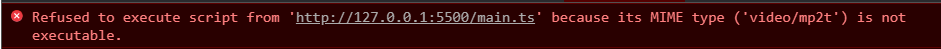

## 타입스크립트 BASIC 01

### Typed JavaScript at Any Scale.

현재 실무에서도 사용중이지만,
강력한 타입 지정으로 `엄격한 프로그래밍`을 할 수있는 TYPESCRIPT를 기초부터
다시 다져가보려고한다.

@ 맛보기

작업할 폴더를 하나만들어보자.

mkdir typescript

```ts
// main.ts
console.log('hello world !')
```

```js
// index.html
<!DOCTYPE html>
<html lang="en">
  <head>
    <meta charset="UTF-8" />
    <meta http-equiv="X-UA-Compatible" content="IE=edge" />
    <meta name="viewport" content="width=device-width, initial-scale=1.0" />
    <script src="./main.ts" />
    // 작성한 ts파일을 import 해본다면?
    <title>Document</title>
  </head>
  <body></body>
</html>
```

다음과 같은 에러가 발생한다.



즉, 브라우저는 ts파일 그 자체를 읽을순없다. 따라서 컴파일러 툴을 이용하여 ts파일을 js로 컴파일화 해줘야한다.

```
tsc main.ts
```

js 파일이 떨궈지며 읽혀진다.

TS는 이러한 컴파일 작용을 작용을 하며 브라우저가 읽을 수 있게 해주어야한다.

다음 포스팅 부터는 타입을 직접 지정해가며 예시와 함께 해보려고한다.
